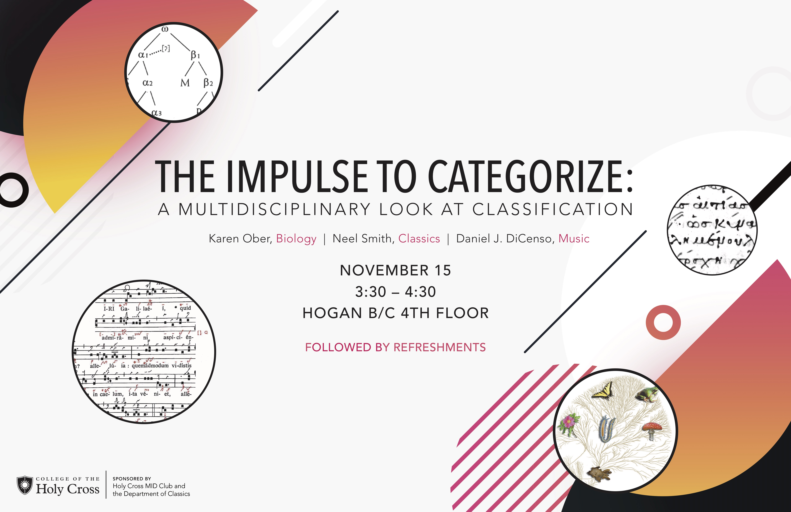

## Special events

-  "A multidisciplinary look at classification."  **Thurs., Nov. 15, 3:30-4:30**, Hogan B/C (fourth floor).  MID is co-sponsoring with the Classics Department a round table on "Classification," with participating faculty from Biology, Music and Classics.
 
-  We're hosting another hackathon!  [More info beginning to appear here](ms-hackathon-2019).

## Regular meetings

Regular meeting times during the academic year:  Fridays, 2:00-5:00, fourth floor of Fenwick Hall.

## Ongoing projects (AY 2018-19) ##

Returning projects:

-   The Homer Multitext project:   work on three new manuscripts, while revising our first edition of the Venetus A manuscript.
-   Latin liturgical manuscripts with chant annotated with neumes.  ([Github repository](https://github.com/HCMID/chant).)
-   Pliny the Elder, *Natural History*: the Bamberg manuscript.  ([Github repository](https://github.com/HCMID/plinius).)

## Technical help

-  [Resources for MID projects](tech).

## Hall of Fame

-   [conference papers,  publications, and funded research](hof) from members of HC MID Club
-   [map HC MID outside of Worcester](where)

## Other special events

- In February, 2018, we hosted a [manuscripts hackathon](https://hcmid.github.io/ms-hackathon-2018/)!
- We occasionally host [presentations from others](hosted), and participate in the program of Digital Classicist New England.

## Mission Statement

>The aim of the Manuscripts, Inscriptions and Documents Club shall be to further the study of these academic fields: paleography, codicology, epigraphy, as well as the study of languages. We strive for undergraduate inclusion in research.

## Keeping up with HC MID

Follow us from

- our [atom feed](atom.xml)
- [twitter](https://twitter.com/hcmid)
