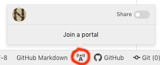

Any HCMID member with access to the internet on your phone or a computer can take part in collaborative editing sessions, in one of these roles:

- consultant
- editor
- session host

## Consultant

*Consultants* can read manuscripts online and take part in the team's video chats.  Requirements: a device (computer, tablet, phone) with internet access and:

- a web browser.  **Test**: to test your browser, browse, zoom, and pan [this page of the Venetus A manuscript of the *Iliad*](http://www.homermultitext.org/ict2/)
- video conferencing software.  Beginning in summer 2020, we're using [Zoom](https://zoom.us/download))

## Editor

*Editors* can do everything consultants can do, plus they can directly edit the team's XML documents and structured text files.  Requirements:  in addition to the requirements for consultants, editors need:

- a computer with the [Atom editor](https://atom.io/), and the teletype plugin.  **Test**: when you open Atom, you should find an icon like the one marked here at the bottom of your Atom window, and be able to open a menu as illustrated here by clicking on it.

## Session host

*Session hosts* manage the team's github repository, and run validation scripts to check the team's editorial work.  Requirements: in addition to the requirements for editors, session hosts need:

- a working account on github.  **Test**: you know your github password and can actually login!
- bash shell and git. **Test**:  if you open a bash shell, type `which git`, you see some result.
- a working account on dockerhub.  **Test**: you know your dockerhub password and can actually login!
- either Docker Desktop (OS X users) or Docker Toolbox (Windows users).  **Test**: open a bash shell (OS X users) or a Docker shell (Windows users) and type `docker run hello-world`.  You should see docker download a Docker *image* and run a Docker *container* that (eventually) writes some output to your terminal.
